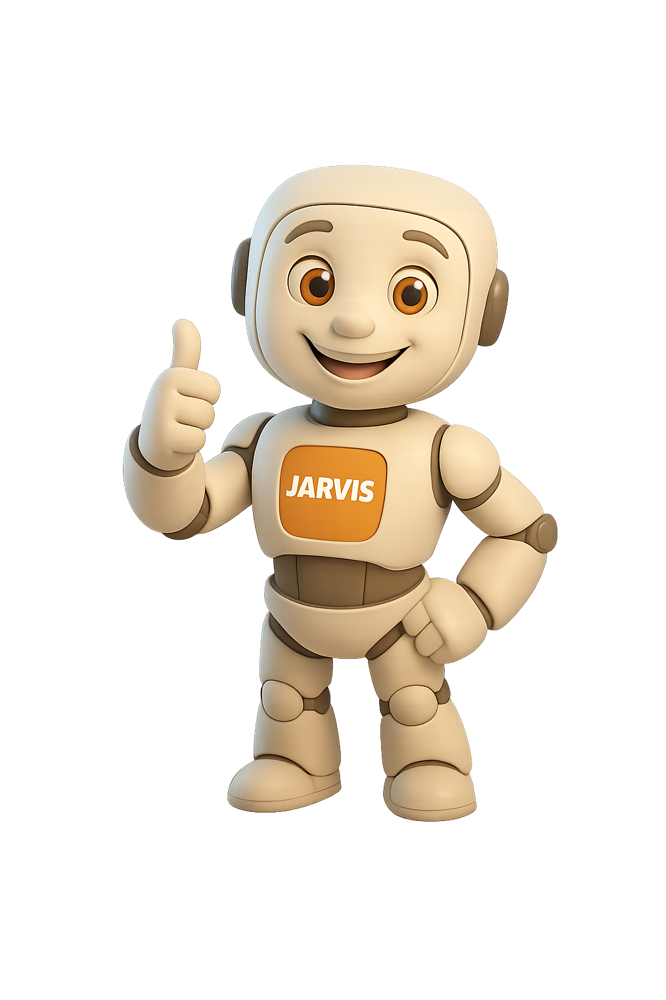

🚀 Jarvis AI — Your Personal Voice-Enabled Chat Assistant

Live Demo: https://jarvis-chat-model.vercel.app

A futuristic, glassmorphic AI chatbot built with React + FastAPI + Groq (Llama-3.3-70B).
Features smooth UI, voice replies, intelligent responses, and real-time chat.

🧠 Chatbot Preview
🟦 Jarvis AI

✨ Features
🎨 Glassmorphic Futuristic UI

Clean, animated interface inspired by Jarvis from Iron Man.

🤖 AI-Powered Chat

Replies generated via Groq Llama-3.3-70B, optimized for speed & quality.

🔊 Voice Output (TTS)

AI messages are spoken aloud using the browser's speech synthesis engine.

⚡ Fast & Secure Communication

🌍 Deployment Links
✔️ Frontend (Vercel)

https://jarvis-chat-model.vercel.app

✔️ Backend (Render)

https://jarvis-chatmodelbackend.onrender.com/ask

🚀 Roadmap

⏳ Voice input (speech-to-text)

📜 Chat history with cloud storage

🎨 Animated typing effect (ChatGPT-like)

🧊 Multi-mode personalities (Tech • Fun • Assistant)

❤️ Credits

Developed by Prachi Vernekar

AI Powered by Groq Llama-3.3-70B

Frontend Hosting: Vercel

Backend Hosting: Render
